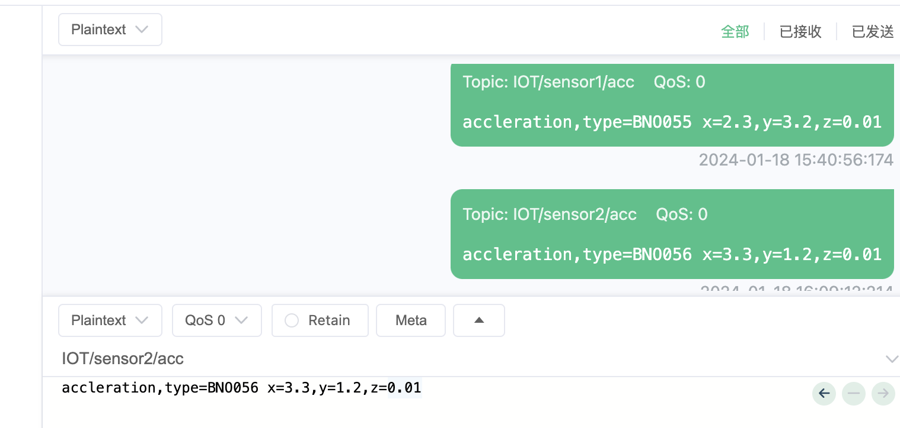
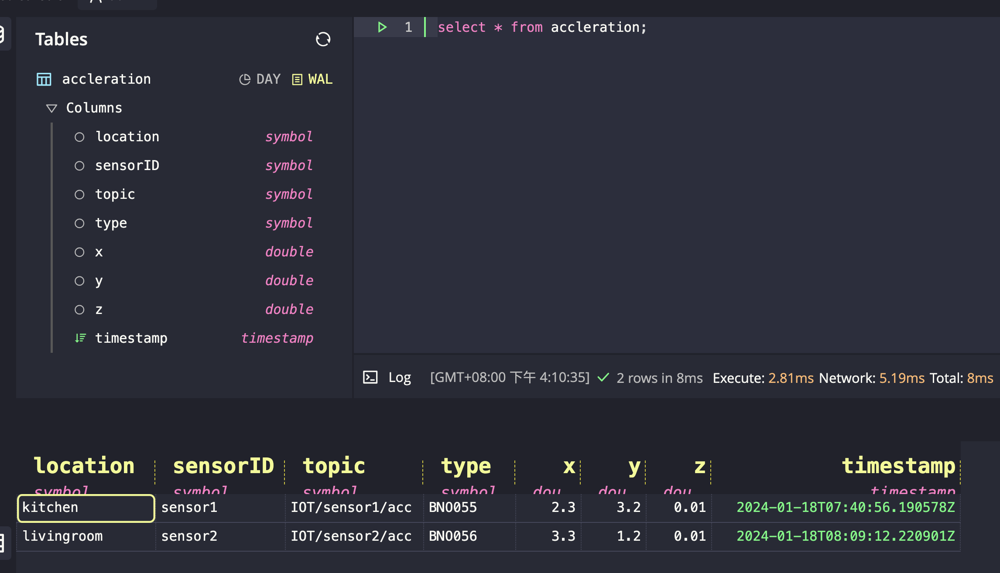

# 方案概要

* Mqtt
* Telegraf 使用MQTT Consumer input
* QuestDB

说明文档:https://shantanoo-desai.github.io/posts/technology/questitto_light_stack_for_iot/


## telegraf.conf

```toml

##################################################################
#                   INPUT PLUGINS                                #
##################################################################

[[inputs.mqtt_consumer]]

    servers = [ "tcp://mosquitto:1883" ]

    # Topics to subscribe to:
    topics = [
        "IOT/+/acc",
        "IOT/+/mag",
        "IOT/+/gyro",
        "IOT/+/temp"
    ]

    # Telegraf will also store the topic as a tag with name `topic`
    # NOTE: necessary for the Processor REGEX to extract <Sensor_ID>
    topic_tag = "topic"

    username = "${TG_MOSQUITTO_USERNAME}"
    password = "${TG_MOSQUITTO_PASSWORD}"

    # Connection timeout
    connection_timeout = "30s"

    # Incoming MQTT Payload from Sensor nodes is in InfluxDB Line Protocol strings
    data_format = "influx"

[[processors.regex]]

    order = 1

    [[processors.regex.tags]]

        # use the `topic` tag to extract information from the MQTT Topic
        # 针对名为‘topic’的tag运用正则
        key = "topic"
        # Topic: IOT/<SENSOR_ID>/<measurement>
        # Extract <SENSOR_ID>
        pattern = ".*/(.*)/.*"
        # Replace the first occurrence
        replacement = "${1}"
        # Store it in tag called:
        result_key = "sensorID"


[[processors.enum]]

    order = 2

    [[processors.enum.mapping]]

        # create a mapping between extracted sensorID and some meta-data
        tag = "sensorID"
        dest = "location"
        # sensorID映射为location

        [processors.enum.mapping.value_mappings]
            "sensor1" = "kitchen"
            "sensor2" = "livingroom"

            # sensorID= sensor1时: location = kitchen
            # sensorID= sensor2时: location = livingroom

```

说明：
当topic为IOT/sensor1/acc，ILP中，tag为：topic=IOT/sensor1/acc，变成sensorID=sensor1,location = kitchen
当topic为IOT/sensor2/acc，ILP中，tag为：topic=IOT/sensor2/acc，变成sensorID=sensor2,location = livingroom


## 测试

用mqttx当作测试客户端。https://mqttfx.org/



在questdb的web console上查看结果：

上述processors会把转换过后的tag+Influx Line Protocol中的tag+field组合成一张Table的字段。




