**### 声明：图片和内容来自以下文档
* https://public.dhe.ibm.com/software/dw/webservices/ws-mqtt/mqtt-v3r1.html
* https://docs.oasis-open.org/mqtt/mqtt/v3.1.1/mqtt-v3.1.1.html
* https://www.emqx.com/zh/blog/introduction-to-mqtt-qos

# 概要

----

MQ Telemetry Transport (MQTT)，基于broker，发布/订阅的消息协议，适用于下面场景
* 流量昂贵，低带宽，网络不可靠
* 在有限资源的嵌入式设备上

在TCP协议上

# 数据流

-----
## QoS

### QoS 0

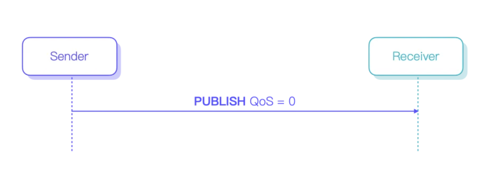

通常选择使用 QoS 0 传输一些高频且不那么重要的数据，比如传感器数据

### QoS 1

可以保证消息到达，所以适合传输一些较为重要的数据，比如下达关键指令、更新重要的有实时性要求的状态等。
通常 QoS 0 与 QoS 1 能够达到的吞吐比较接近，不过 QoS 1 的 CPU 占用会略高于 QoS 0

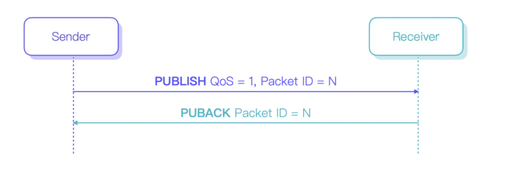

### QoS 2

既可以保证消息到达，也可以保证消息不会重复，但传输成本最高，通常会在金融、航空等行业场景下会更多地见到 QoS 2 的使用。
QoS 2 能够达到的吞吐一般仅为 QoS 0、1 的一半左右

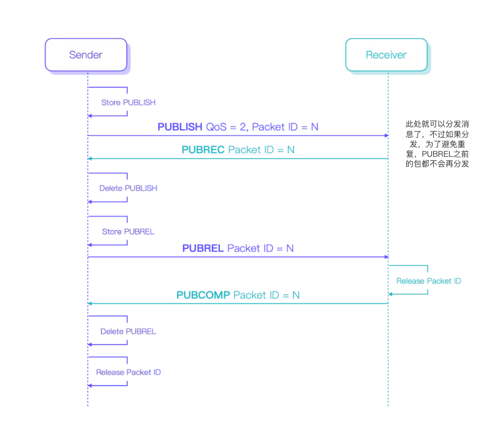

QoS 2 规定，发送方只有在收到 PUBREC 报文之前可以重传 PUBLISH 报文。一旦收到 PUBREC 报文并发出 PUBREL 报文，发送方就进入了 Packet ID 释放流程，不可以再使用当前 Packet ID 重传 PUBLISH 报文。同时，在收到对端回复的 PUBCOMP 报文确认双方都完成 Packet ID 释放之前，也不可以使用当前 Packet ID 发送新的消息。因此，对于接收方来说，能够以 PUBREL 报文为界限，凡是在 PUBREL 报文之前到达的 PUBLISH 报文，都必然是重复的消息；而凡是在 PUBREL 报文之后到达的 PUBLISH 报文，都必然是全新的消息。
一旦有了这个前提，我们就能够在协议层面完成 QoS 2 消息的去重。

更详尽的解释可以参考:https://www.emqx.com/zh/blog/introduction-to-mqtt-qos

# 消息格式概览

----

## Fixed header(Fixed Header)

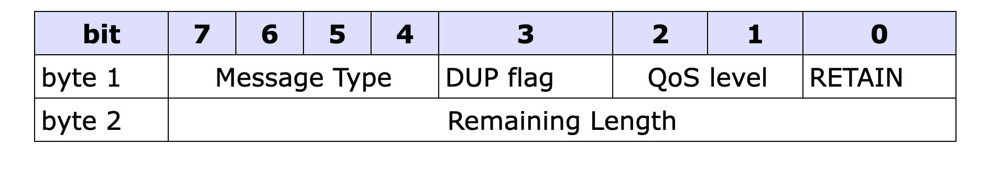

* 字节1:消息类型+FLag(DUP, QoS level, and RETAIN)
* 字节2:剩余长度 

### 消息类型

### Flags

#### DUP 
	
当client或者server重发 PUBLISH, PUBREL, SUBSCRIBE or UNSUBSCRIBE 时，设置DUP。
这适用于 QoS 值大于零 (0) 且需要确认的消息。当设置 DUP 位时，变量标头包含消息ID。
QoS=0时，DUP=0。

当服务器将 PUBLISH 数据包发送给订阅者时，不会传播传入 PUBLISH 数据包中的 DUP 标志值。传出 PUBLISH 数据包中的 DUP 标志独立于传入 PUBLISH 数据包设置，其值必须仅由传出 PUBLISH 数据包是否重传来确定。

#### Qos

#### RETAIN

该标志仅用于PUBLISH消息。

### 剩余长度

从Fixed header的第二个字节开始,表示[Variable header(Variable Header)+有效载荷(Payload)]部分的长度，是个可变长度，最大4子节，最小1子节。剩余长度不包含自己本身的长度。

* 小于128字节 直接用单子节编码
* 大于128字节 低字节7位编码数字，第8位指示是否有更多子节。

### 大于128子节

* 假设是200，二进制是1100 1000，第八位是1，所以要再用一个字节表示，第八位的1代表进位，原来的1转移到下一个子节，变成 0000 0001 0100 1000
* 假设是1000，二进制是0011 1110 1000，超过7位了，所以要再用一个字节表示，第八位的1代表进位，原来的1转移到下一个子节，变成 0000 0111 1110 1000
* 假设是321，二进制是0001 0100 0001，超过7位了，所以要再用一个字节表示，第八位的1代表进位，原来的0转移到下一个子节，变成0000 0010 1100 0001

## Variable header(Variable Header)

在Fixed header和有效载荷之间

## 有效载荷(Payload)

应用消息，包含Payload的报文如下

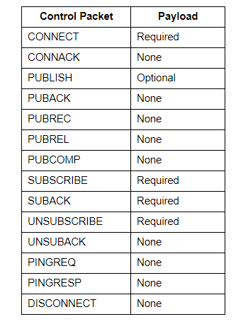

# 控制报文详解

----

## CONNECT 连接请求

clinet->server，客户端向服务器建立连接后发送的第一个报文，只能发一次，重发会断开现在的链接。

### Fixed header

剩余长度=Variable header10字节+Payload长度

### Variable header

Protocol Name + Protocol Level + Connect Flags = 10个字节

#### Protocol Name

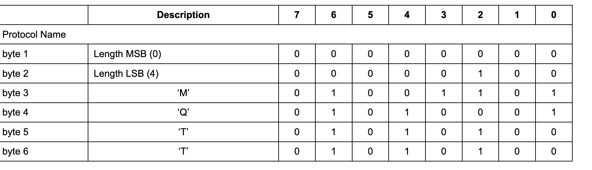

#### Protocol Level

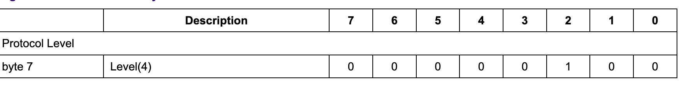

#### Connect Flags

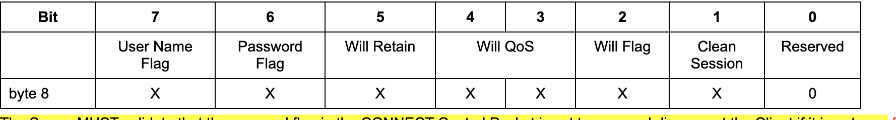

服务器必须验证 CONNECT 控制数据包中的RETAIN是否设置为零，如果不为零，则断开客户端连接 

##### Clean Session

代表Session处理方式。

Client和Server需要保存的会话如下

1. Client Session:

* 已发送给服务端，但是还没有完成确认的 QoS 1 和 QoS 2 消息
* 从服务端收到的，但是还没有完成确认的 QoS 2 消息

2. Server Session:

* 会话是否存在  
* 客户端订阅列表
* 已发送给客户端，但是还没完成确认的QoS 1 和 QoS 2消息
* 等待传输到客户端的Qos 0(可选)，Qos 1 Qos 2消息
* 已从客户端收到但尚未确认的 QoS 2 消息

处理场景
* clean session=0 服务器必须根据当前会话的状态（由客户端标识符标识）恢复与客户端的通信。如果没有与客户端标识符关联的会话，服务器必须创建一个新会话。客户端和服务器断开连接后，客户端和服务器必须存储会话。会话断开连接后，服务器必须存储与断开连接时客户端拥有的任何订阅相匹配的QoS 1 和 QoS 2 消息，作为会话状态的一部分
* clean session=1 客户端和服务器必须放弃任何先前保存的会话并开始一个新的会话。

##### Will Flag
代表是否有遗嘱。

如果CONNECT报文的Will Flag=1，Server必须保存对应的Will Message。
当client的网络连接关闭时，必须发布Will Message。以下几种场景都判定为需要发布Will Message:

* An I/O error or network failure detected by the Server.
* The Client fails to communicate within the Keep Alive time.
* The Client closes the Network Connection without first sending a DISCONNECT Packet.
* The Server closes the Network Connection because of a protocol error.

1. Will Flag=1

* Server使用Will QoS和Will RETAIN，Will Topic & Will Message要包含在Payload
* Will Message被Server发布后，或者Server收到DISCONNECT后，就会被移除

2. Will Flag=0

* Will QoS和Will RETAIN=0，Will Topic & Will Message不在Payload
* 网络关闭后，Will Message不发布

##### Will QoS

* Will Flag=1，Will Qos=0/1/2
* Will Flag=0，Will Qos=0

##### Will Retain

表明Will Message是否要被保留

* Will Flag=1，Will Qos=0/1/2
* Will Flag=0，Will Qos=0

##### UserName Flag

* 0，Payload不包含
* 1，Payload包含

##### Password Flag

* 0，Payload不包含
* 1，Payload包含

##### Keep alive

单位是秒，代表客户端发送两次 MQTT 协议包之间的最大间隔时间。

在连接建立后，客户端需要确保, 自己任意两次 MQTT 协议包的发送间隔不超过 Keep Alive 的值，如果客户端当前处于空闲状态，没有可发送的包，则可以发送 PINGREQ 协议包。

* 如果KeepAlive>0,server在1.5倍KeepAlive事件内没有收到client的数据包，必须断开和client的链接。

Variable header例子：

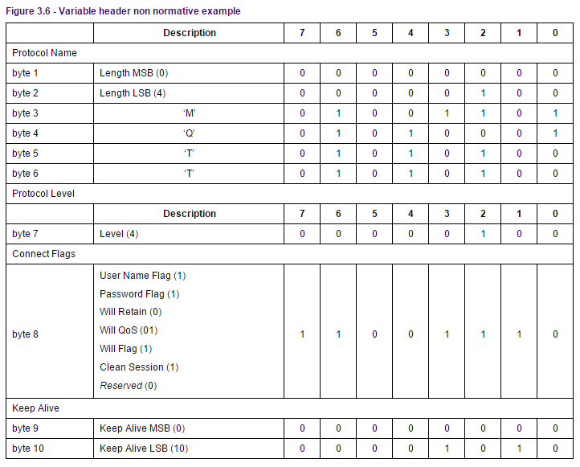

### Payload

内容由Variable header中的标识位决定,按照下面顺序出现：
* 客户端标识符(Client Identifier) 每个连接到服务器的客户端都有一个唯一的ClientId，并且是Payload第一个字段  
  1到23字节，只能包含大小写数字
* 遗嘱主题(Will Topic)
* 遗嘱消息(Will Message)
* 用户名(User Name)
* 密码(Password) 

### Response

连接建立后，如果一段时间后没收到CONNECT包，Server应该关闭连接。

## CONNACK 确认连接请求

server->client， 服务端发送CONNACK报文响应从客户端收到的CONNECT，服务端发给客户端的第一个报文必须是CONNACK。

### Fixed header

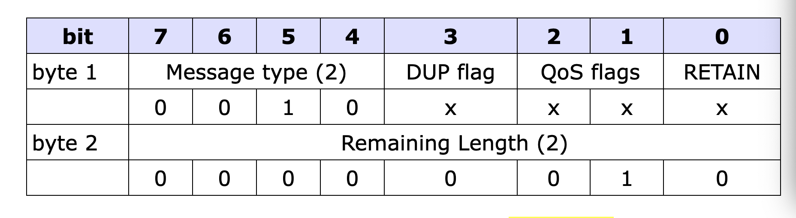

### Variable header

第1个字节是 连接确认标志，位7-1是保留位且必须设置为0。第0 (SP)位 是当前会话（Session Present）标志。
第2个字节是 返回码Return code，如果返回非0，SP=0

#### Session Present

* Clean Session=1：Server设置SP=0，返回码=0
* Clean Session=0：
  - 已保存会话状态：返回码=0，SP=1
  - 未保存会话状态：返回码=0，SP=0

#### Return code

 
### Payload
无

## PUBLISH 发布

server<->client，发送应用消息。

### Fixed header

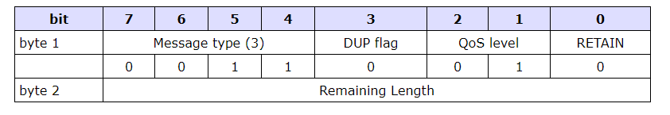

#### DUP 重发标志

* DUP=0，第一次发送PUBLISH消息，如果Qos=0，DUP必须为0
* DUP=1，重传消息

#### Qos
* Qos-H Qos高位
* Qos-L Qos低位

#### RETAIN

* 当客户端向服务器发送PUBLISH消息时，如果RETAIN=1，则服务器应保留消息和Qos。当有新client订阅Topic时，最后保留的消息将被发送到client。
* 当服务端收到一条RETAIN=1，QoS=0消息，它必须丢弃之前为那个Topic保留的任何消息。它应该将这个新的QoS 0消息当作那个主题的新保留消息。

### Variable header

* 主题名Topic Name
* 报文标识符Packet Identifier 只有当QoS等级是1或2时，报文标识符字段才能出现在PUBLISH报文中

### Payload

应用消息。

### Response

PUBLISH报文的接收者必须按照根据PUBLISH报文中的QoS等级发送响应

* Qos=0 无响应
* Qos=1 PUBACK报文
* Qos=2 PUBREC报文

## PUBACK

client<->server，PUBACK报文是对QoS 1等级的PUBLISH报文的响应。

### Fixed header

### Variable header

包含等待确认的PUBLISH报文的报文标识符。

### Payload

无

## PUBREC 发布收到

client<->server，PUBREC报文是对QoS等级2的PUBLISH报文的响应。它是QoS 2等级协议交换的第二个报文。

### Fixed header

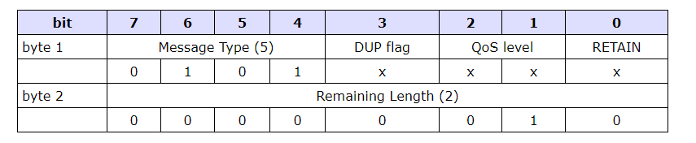

### Variable header

### Payload

无

## PUBREL 发布释放

client<->server，PUBREL报文是对PUBREC报文的响应。它是QoS 2等级协议交换的第三个报文。

### Fixed header

### Variable header

### Payload

无

## PUBCOMP 发布完成

client<->server，PUBCOMP报文是对PUBREL报文的响应。它是QoS 2等级协议交换的第四个也是最后一个报文。

### Fixed header

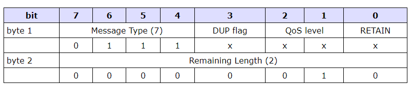

### Variable header

### Payload

无

## SUBSCRIBE 订阅主题

client->server，可以订阅1个或者多个主题，订阅之后，server对client发送publish消息，SUBSCRIBE包含qos设置

### Fixed header

剩余长度=Variable header的长度（2字节）加上有效载荷的长度。

### Variable header

Variable header包含报文标识符，2个字节，下图是一个例子，代表标识符为10的Variable header

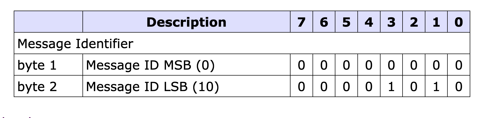

### Payload

内容包含TopicName+Qos,TopicName支持通配符

* publisher qos > subscriber qos:use subscriber qos
* publisher qos <= subscriber qos:use publisher qos

### Response

当server收到SUBSCRIBE，向client返回SUBACK。client收到SUBACK之前，server就可能继续发送PUBLISH

## SUBACK 订阅响应

server->client，确定收到SUBSCRIBE。

### Fixed header

### Variable header

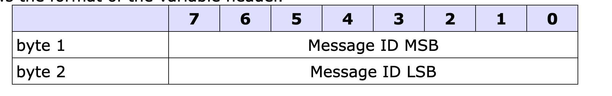

### Payload

payload中包含qos的列表,跟SUBSCRIBE中的qos列表顺序一致

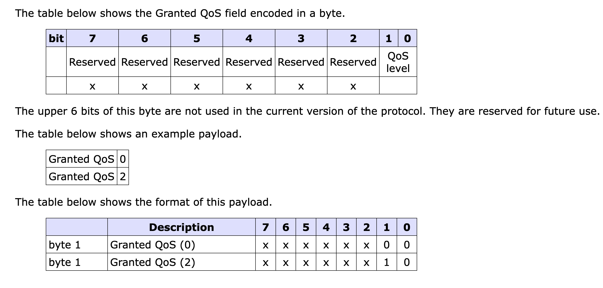

## UNSUBSCRIBE 取消订阅

clinet->server，取消订阅Topic

### Fixed header

QoS=1

### Variable header

消息ID

### Payload

payload中包含qos的列表,跟SUBSCRIBE中的qos列表顺序一致

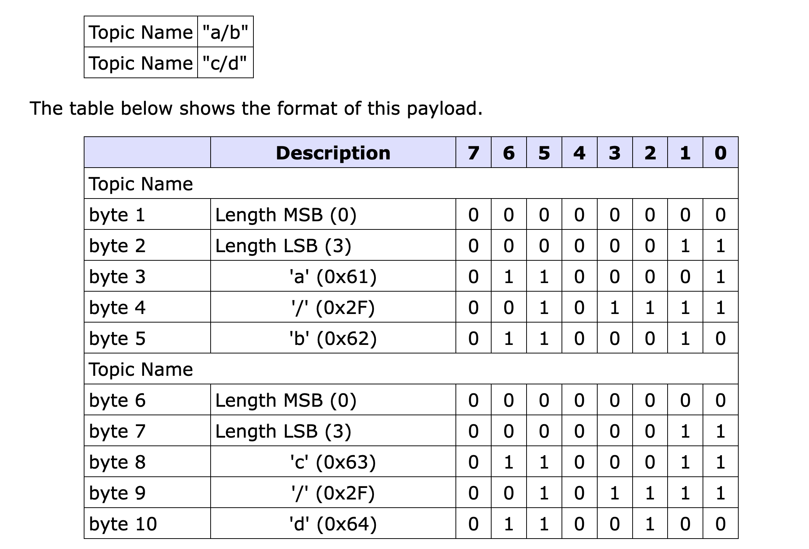

## UNSUBACK 取消订阅确认

server->client，确定收到UNSUBSCRIBE

### Fixed header

### Variable header

消息ID

### Payload

无

## PINGREQ 心跳请求

client->server

### Fixed header

### Variable header

无

### Payload

无

## PINGRESP 心跳响应

server->client

### Fixed header

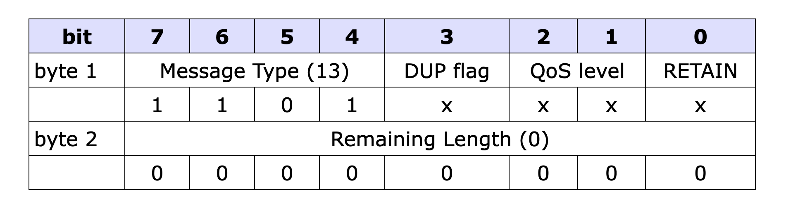

### Variable header

无

### Payload

无

## DISCONNECT

client->server，关闭TCP链接

### Fixed header

### Variable header

无

### Payload

无

