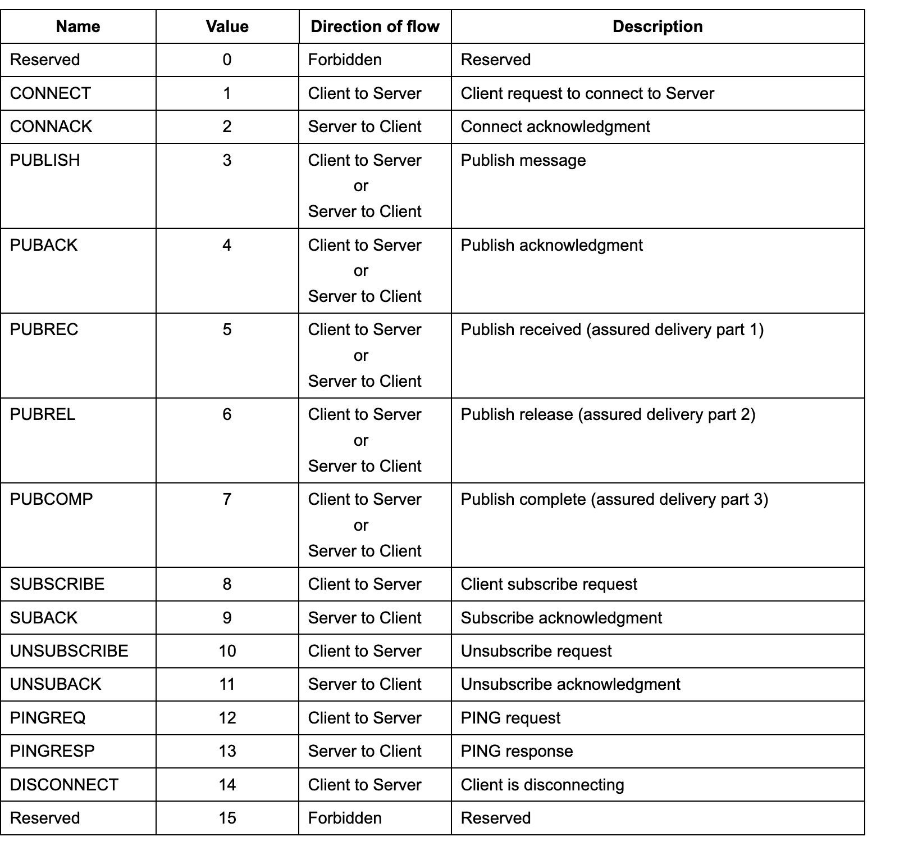
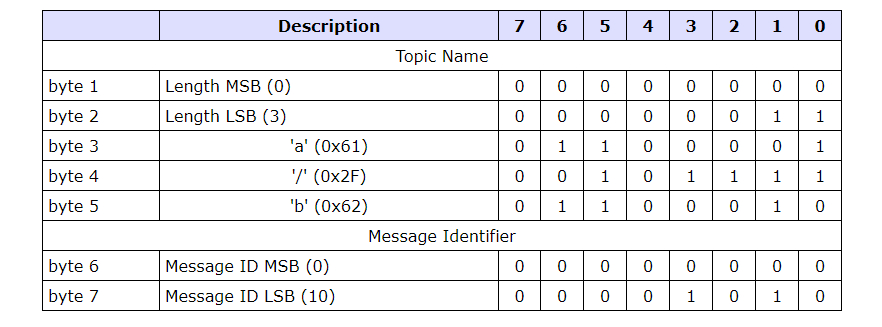
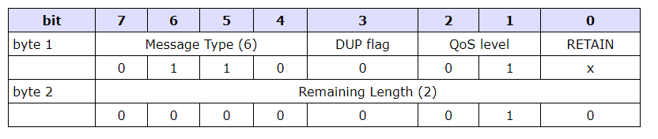

### 声明：图片和内容来自以下文档
* https://public.dhe.ibm.com/software/dw/webservices/ws-mqtt/mqtt-v3r1.html
* https://docs.oasis-open.org/mqtt/mqtt/v3.1.1/mqtt-v3.1.1.html

# 概要

----

MQ Telemetry Transport (MQTT)，基于broker，发布/订阅的消息协议，适用于下面场景
* 流量昂贵，低带宽，网络不可靠
* 在有限资源的嵌入式设备上

在TCP协议上

# 数据流

----

# 消息格式

----

## 固定报头(Fixed Header)

* 字节1:消息类型+FLag(DUP, QoS level, and RETAIN)
* 字节2:剩余长度 

### 消息类型

### Flags

#### DUP 
	
当client或者server重发 PUBLISH, PUBREL, SUBSCRIBE or UNSUBSCRIBE 时，设置DUP。
这适用于 QoS 值大于零 (0) 且需要确认的消息。当设置 DUP 位时，变量标头包含消息ID。

#### Qos

#### RETAIN

该标志仅用于PUBLISH消息，当客户端向服务器发送PUBLISH消息时，如果保留标志设置为(1)，则服务器应在将消息传递给当前订阅者后保留该消息。当有新client订阅时，最后保留的消息将被发送到client。

1. 客户端->服务端

如果客户端发给服务端的PUBLISH报文的保留（RETAIN）标志被设置为1，服务端必须存储这个应用消息和它的服务质量等级（QoS）。一个新的订阅建立时，对每个匹配的主题名，如果存在最近保留的消息，它必须被发送给这个订阅者。

如果服务端收到一条保留（RETAIN）标志为1的QoS 0消息，它必须丢弃之前为那个主题保留的任何消息。它应该将这个新的QoS 0消息当作那个主题的新保留消息。

2. 服务端->客户端

### 剩余长度

从固定报头的第二个字节开始,表示[可变报头(Variable Header)+有效载荷(Payload)]部分的长度，是个可变长度，最大4子节，最小1子节

* 小于128字节 直接用单子节编码
* 大于128字节 低字节7位编码数字，第8位指示是否有更多子节。

### 大于128子节

* 假设是200，二进制是1100 1000，第八位是1，所以要再用一个字节表示，第八位的1代表进位，原来的1转移到下一个子节，变成 0000 0001 0100 1000
* 假设是1000，二进制是0011 1110 1000，超过7位了，所以要再用一个字节表示，第八位的1代表进位，原来的1转移到下一个子节，变成 0000 0111 1110 1000
* 假设是321，二进制是0001 0100 0001，超过7位了，所以要再用一个字节表示，第八位的1代表进位，原来的0转移到下一个子节，变成0000 0010 1100 0001

## 可变报头(Variable Header)

在固定报头和有效载荷之间

### 报文标识符

2个字节

* PUBLISH(QOS>0)
* SUBSCRIBE
* UNSUBSCRIBE

以上报文每发送一个，要分配一个没使用的，重发报文时，要用相同的标识。

## 有效载荷(Payload)

应用消息

# 控制报文详解

----

## CONNECT 连接请求
客户端向服务器建立连接后发送的第一个报文，只能发一次，重发会断开现在的链接。

### 固定报头

剩余长度=可变报头10字节+Payload长度

### 可变报头

10个字节

### 字节1-10 协议名

* 字节1 协议名长度高字节，数字0 
* 字节2 协议名长度低字节，数字4
* 字节3 M
* 字节4 Q
* 字节5 T
* 字节6 T
* 字节7 协议级别，数字4
* 字节8 链接标志，第一位是保留标志位，如果不是0则断开客户链接,2-8位分别代表不同的信息
* 字节9 KEEPALIVE时间 高字节
* 字节10 KEEPALIVE时间 低字节

keepalive表示两个控制报文之间允许最大的空闲间隔

### Payload

内容由可变报头中的标识位决定,按照下面顺序出现：
* 客户端标识符Will Topic 服务端使用clientId识别客户端,必须存在，并且是Payload第一个字段  
  1到23字节，只能包含大小写数字
* 遗嘱主题(Will Topic)
* 遗嘱消息(Will Message)
* 用户名(User Name)
* 密码(Password) 

## CONNACK 确认连接请求
服务端发送CONNACK报文响应从客户端收到的CONNECT，服务端发给客户端的第一个报文必须是CONNACK。

### 固定报头

### 可变报头

第1个字节是 连接确认标志，位7-1是保留位且必须设置为0。第0 (SP)位 是当前会话（Session Present）标志。
第2个字节是 返回码，如果返回非0，SP=0
* clearSession=1：返回码=0，SP=0
* clearSession=0：
  - 已保存会话状态：返回码=0，SP=1
  - 未保存会话状态：返回码=0，SP=0
 
 
### Payload
无

## PUBLISH 发布

### 固定报头

* DUP 重发标志
  - 重发消息=1
  - QoS=0,DUP=1
* Qos-H Qos高位
* Qos-L Qos低位
* RETAIN 保留标志

### 可变报头

* 主题名
* 报文标识符 只有当QoS等级是1或2时，报文标识符（Packet Identifier）字段才能出现在PUBLISH报文中

### Payload

应用消息。

### 响应

PUBLISH报文的接收者必须按照根据PUBLISH报文中的QoS等级发送响应

* Qos=0 无响应
* Qos=1 PUBACK报文
* Qos=2 PUBREC报文

## PUBACK

PUBACK报文是对QoS 1等级的PUBLISH报文的响应。

### 固定报头

### 可变报头

包含等待确认的PUBLISH报文的报文标识符。

### Payload

无

## PUBREC 发布收到

PUBREC报文是对QoS等级2的PUBLISH报文的响应。它是QoS 2等级协议交换的第二个报文。

### 固定报头

### 可变报头

### Payload

无

## PUBREL 发布释放

PUBREL报文是对PUBREC报文的响应。它是QoS 2等级协议交换的第三个报文。

### 固定报头

### 可变报头

### Payload

无

## PUBCOMP 发布完成

PUBCOMP报文是对PUBREL报文的响应。它是QoS 2等级协议交换的第四个也是最后一个报文。

### 固定报头

### 可变报头

### Payload

无

## SUBSCRIBE 订阅主题

client->server，可以订阅1个或者多个主题，订阅之后，server对client发送publish消息，SUBSCRIBE包含qos设置

### 固定报头

剩余长度=可变报头的长度（2字节）加上有效载荷的长度。

### 可变报头

可变报头包含报文标识符，2个字节，下图是一个例子，代表标识符为10的可变报头

### Payload

内容包含TopicName+Qos,TopicName支持通配符

* publisher qos > subscriber qos:use subscriber qos
* publisher qos <= subscriber qos:use publisher qos

### Response

当server收到SUBSCRIBE，向client返回SUBACK。client收到SUBACK之前，server就可能继续发送PUBLISH

## SUBACK 订阅响应

server->client，确定收到SUBSCRIBE。

### Fixed header

### Variable header

### Payload

payload中包含qos的列表,跟SUBSCRIBE中的qos列表顺序一致

## UNSUBSCRIBE 取消订阅

clinet->server，取消订阅Topic

### Fixed header

QoS=1

### Variable header

消息ID

### Payload

payload中包含qos的列表,跟SUBSCRIBE中的qos列表顺序一致

## UNSUBACK 取消订阅确认

server->client，确定收到UNSUBSCRIBE

### Fixed header

### Variable header

消息ID

### Payload

无

## PINGREQ 心跳请求

client->server

### Fixed header

### Variable header

无

### Payload

无

## PINGRESP 心跳响应

server->client

### Fixed header

### Variable header

无

### Payload

无

## DISCONNECT

client->server，关闭TCP链接

### Fixed header

### Variable header

无

### Payload

无

