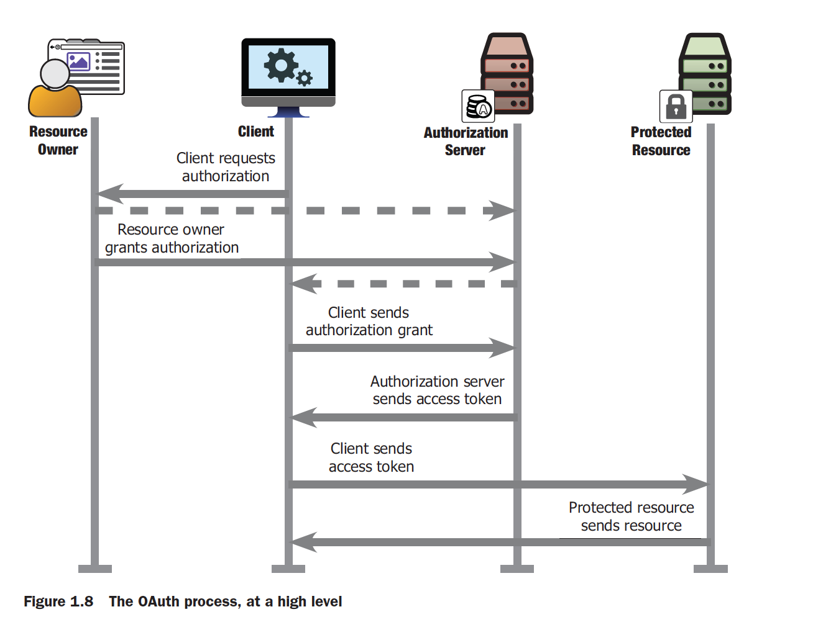
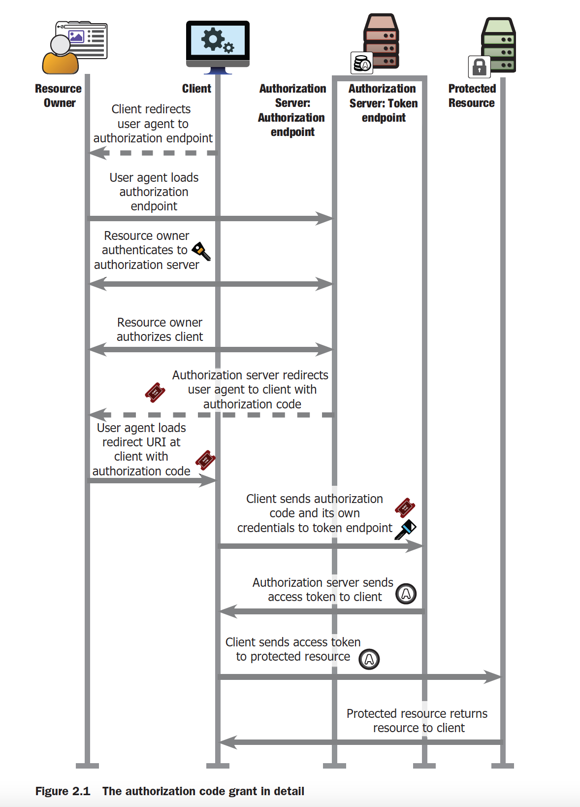
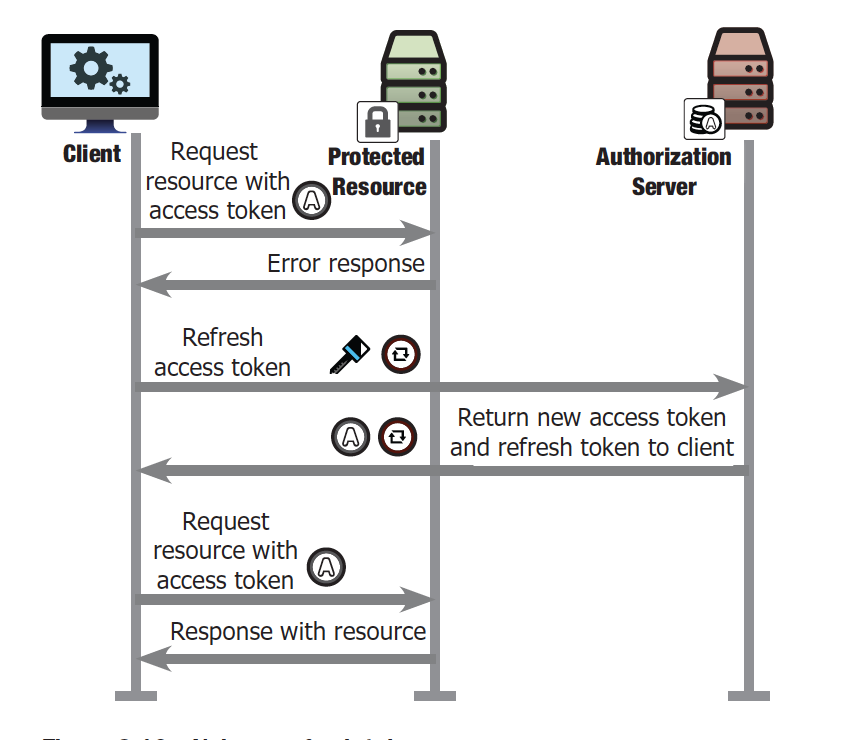

# oAuth2

oAauth是一个基于HTTP的协议

## 组件
* resource owner 资源拥有者，有权将访问权限授权给客户端的主体。资源拥有者是一个人，使用客户端软件访问受他控制的资源。
* protected resource 受到保护的资源，能够通过HTTP服务器访问，访问时候需要oAuth访问令牌。
* client 客户端，资源拥有者使用的软件，可以访问受保护资源。从授权服务器获取令牌，在受保护资源上使用令牌。令牌对客户端来说是不透明的字符串。oAuth客户端可以是Web应用，原生应用，浏览器内的Js应用。
* authorization server 授权服务器，被受保护资源信任，桥接客户端和受保护资源，是一个HTTP服务器，对资源拥有者和客户端进行认证，让资源拥有者向客户端授权，为客户端颁发令牌。

## 授权大致流程

资源拥有者向客户端表示他希望客户端代表他执行一些任务（例如“从该服务下载我的照片”）

1. 客户端请求授权
2. 资源拥有者许可授权
3. 客户端发送授权许可
4. 授权服务器发送访问令牌
5. 客户端发送访问令牌
6. 受保护资源发送资源

## 授权许可完整流程

1. 客户端将用户代理重定向至授权端点
2. 用户代理加载授权端点
3. 资源拥有者向授权服务器进行身份认证
4. 资源拥有者向客户端授权
5. 授权服务器将用户代理重定向到客户端，携带授权码
6. 用户代理在客户端上加载携带授权码的重定向URI
7. 客户端发送验证码和自身凭据给验证服务器
8. 验证服务器发送令牌给客户端
9. 客户端发送令牌给受保护资源
10. 受保护资源给客户端返回资源

## 刷新令牌

