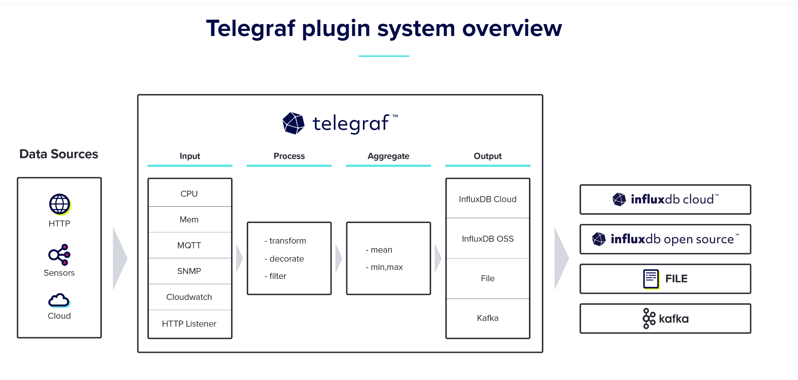
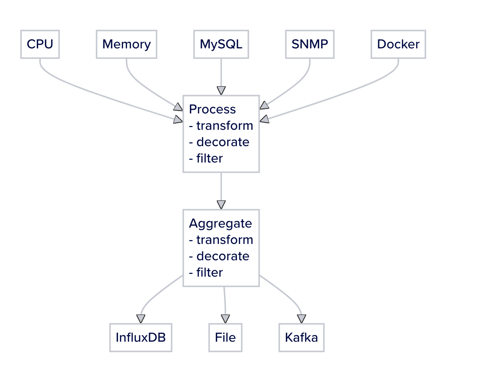

# Telegraf

influxdb开发的，可以用来收集和发送ioT数据。采用GO语言编写，轻量化。

https://www.influxdata.com/time-series-platform/telegraf/

## 功能示意图



## plugins

* Input
* Process
* Aggregate
* Output

## 数据模型

* Measurement name 命名空间
* Tags Key/Value标识数据指标
* Fields Key/Value代表数据
* Timestamp 关联fields的时间戳

## 安装

### Docker

```sh
# Debian-based image
docker pull telegraf
# Alpine-based image
docker pull telegraf:alpine

```

### Linux Binary

```sh
wget https://dl.influxdata.com/telegraf/releases/telegraf-1.29.2_linux_amd64.tar.gz
tar xf telegraf-1.29.2_linux_amd64.tar.gz

```

### Ubuntu

```sh

wget -q https://repos.influxdata.com/influxdata-archive_compat.key
echo '393e8779c89ac8d958f81f942f9ad7fb82a25e133faddaf92e15b16e6ac9ce4c influxdata-archive_compat.key' | sha256sum -c && cat influxdata-archive_compat.key | gpg --dearmor | sudo tee /etc/apt/trusted.gpg.d/influxdata-archive_compat.gpg > /dev/null
echo 'deb [signed-by=/etc/apt/trusted.gpg.d/influxdata-archive_compat.gpg] https://repos.influxdata.com/debian stable main' | sudo tee /etc/apt/sources.list.d/influxdata.list

sudo apt-get update && sudo apt-get install telegraf

```

## 配置

创建一个默认配置文件

```sh
telegraf config > telegraf.conf
```

安装后默认配置文件

`/etc/telegraf/telegraf.conf`


## 插件



插件查询可以访问：https://docs.influxdata.com/telegraf/v1/plugins/

### input

#### MQTT Consumer

https://github.com/influxdata/telegraf/blob/release-1.29/plugins/inputs/mqtt_consumer/README.md

```toml

# Read metrics from MQTT topic(s)
[[inputs.mqtt_consumer]]
  ## Broker URLs for the MQTT server or cluster.  To connect to multiple
  ## clusters or standalone servers, use a separate plugin instance.
  ##   example: servers = ["tcp://localhost:1883"]
  ##            servers = ["ssl://localhost:1883"]
  ##            servers = ["ws://localhost:1883"]
  servers = ["tcp://127.0.0.1:1883"]

  ## Topics that will be subscribed to.
  topics = [
    "telegraf/host01/cpu",
    "telegraf/+/mem",
    "sensors/#",
  ]

  ## The message topic will be stored in a tag specified by this value.  If set
  ## to the empty string no topic tag will be created.
  # topic_tag = "topic"

  ## QoS policy for messages
  ##   0 = at most once
  ##   1 = at least once
  ##   2 = exactly once
  ##
  ## When using a QoS of 1 or 2, you should enable persistent_session to allow
  ## resuming unacknowledged messages.
  # qos = 0

  ## Connection timeout for initial connection in seconds
  # connection_timeout = "30s"

  ## Max undelivered messages
  ## This plugin uses tracking metrics, which ensure messages are read to
  ## outputs before acknowledging them to the original broker to ensure data
  ## is not lost. This option sets the maximum messages to read from the
  ## broker that have not been written by an output.
  ##
  ## This value needs to be picked with awareness of the agent's
  ## metric_batch_size value as well. Setting max undelivered messages too high
  ## can result in a constant stream of data batches to the output. While
  ## setting it too low may never flush the broker's messages.
  # max_undelivered_messages = 1000

  ## Persistent session disables clearing of the client session on connection.
  ## In order for this option to work you must also set client_id to identify
  ## the client.  To receive messages that arrived while the client is offline,
  ## also set the qos option to 1 or 2 and don't forget to also set the QoS when
  ## publishing. Finally, using a persistent session will use the initial
  ## connection topics and not subscribe to any new topics even after
  ## reconnecting or restarting without a change in client ID.
  # persistent_session = false

  ## If unset, a random client ID will be generated.
  # client_id = ""

  ## Username and password to connect MQTT server.
  # username = "telegraf"
  # password = "metricsmetricsmetricsmetrics"

  ## Optional TLS Config
  # tls_ca = "/etc/telegraf/ca.pem"
  # tls_cert = "/etc/telegraf/cert.pem"
  # tls_key = "/etc/telegraf/key.pem"
  ## Use TLS but skip chain & host verification
  # insecure_skip_verify = false

  ## Client trace messages
  ## When set to true, and debug mode enabled in the agent settings, the MQTT
  ## client's messages are included in telegraf logs. These messages are very
  ## noisey, but essential for debugging issues.
  # client_trace = false

  ## Data format to consume.
  ## Each data format has its own unique set of configuration options, read
  ## more about them here:
  ## https://github.com/influxdata/telegraf/blob/master/docs/DATA_FORMATS_INPUT.md
  data_format = "influx"

  ## Enable extracting tag values from MQTT topics
  ## _ denotes an ignored entry in the topic path
  # [[inputs.mqtt_consumer.topic_parsing]]
  #   topic = ""
  #   measurement = ""
  #   tags = ""
  #   fields = ""
  ## Value supported is int, float, unit
  #   [[inputs.mqtt_consumer.topic.types]]
  #      key = type

```

转换例子：

```toml

[[inputs.mqtt_consumer]]
  servers = ["tcp://127.0.0.1:1883"]

  ## Topics that will be subscribed to.
  topics = [
    "telegraf/+/cpu/23",
  ]

  data_format = "value"
  data_type = "float"

  [[inputs.mqtt_consumer.topic_parsing]]
    ## topic名称
    topic = "telegraf/one/cpu/23" 
    ## 第3个作为measurement，这里是cpu
    measurement = "_/_/measurement/_"
    ## 第1个作为tag，这里是cpu
    tags = "tag/_/_/_"
    ## 第4个字符，fieldname=test，value=23
    fields = "_/_/_/test"
    [inputs.mqtt_consumer.topic_parsing.types]
      ## test的value是int类型
      test = "int"

```

结果：

```
cpu,host=pop-os,tag=telegraf,topic=telegraf/one/cpu/23 value=45,test=23i 1637014942460689291

```


### processor

https://docs.influxdata.com/telegraf/v1/plugins/#processor-plugins

### output
